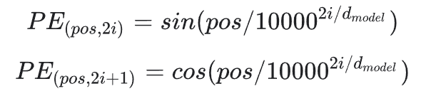

# Transformerについて勉強したことまとめ

NLPに素人として、まだ至らない点も多いが、これまで自分の理解を整理します。

個人的に、Transformerの運用に興味を持つので、下記の疑問点について知りたくて勉強を始まりました。

- どんなデータを食う？
- Attentionの構造は？
- どんな結果を吐く？

これら点について、自分の理解を纏めます。  

## Transformerモデル

Transformerについてすべての知識の紹介を私の能力範囲外です。詳しく情報が欲しかったら、下記の文章の参考してください。  
[自然言語処理の必須知識 Transformer を徹底解説！](https://deepsquare.jp/2020/07/transformer/)  

説明便宜のために、まずTransformerモデルの全体図を張ります。　　

  

説明の例として、下記のタスクとします。  
「あれはロボットです」  
を  
「That is a robot」  
に翻訳する

## __インプット__

Transformerモデルにインプットするデータについて、下記の概念が知る必要です。

- Sequence
- Input to Encoder
- Input to Decoder
- Tokenization
- Positional Embedding

### __*Sequence*__

TransformerはSeq2Seq構造の一種であり、インプットするデータはよくSequenceといいます。これは「順序的なデータ」とのことですね。
例えば、言葉は「順序的な単語」であり、画像は「順序的なピクセル」であります。単語の順／ピクセルの順が変わると意味・画面も変わりますよね。  

NLPの場合、一つSequenceは一つセンテンスであります。「分類AI」などと違うのは、Transformerに食う（インプットする）データは、一つではなく、EncoderとDecoderにそれぞれのSequenceをインプットする必要であります。  
※　Transformer構造図に、Decoderへ食う（初期の）データは「Outputs」と書かれています。ちょっと微妙な表現と思います。個人的に、計算後のデータをアウトプットであり、計算用データはインプットと思っていますので、この「Outputs」もインプットと呼ばせてください。

### __*Encoder Inputs*__

Encoderにインプットするのは「あれはロボットです」。

### __*Decoder Inputs*__

Decoderのインプットは二つソースがあります：

- 「That is a robot」　※
- Encoderの算出結果

※　訓練時のインプットである。推論時に、ここには開始記号（\<s\>）しかない。（後程説明します）  
※　訓練結果チェック用データであるため、Transformer構造図にはこれを「Outputs」と呼びます（？）

Transformer構造図に見えるように、EncoderのアウトプットはDecoderのインプットとして渡されています。

また一つのインプットは、Transformer構造図のDecoderの下に「Outputs(shifted right)」と書かれています。「Shifted right」とは、入力するSequenceの左に"開始"記号を追加することです。  

よって、DecoderにインプットするSequenceは実際に「\<s\> That is a robot」のようになります。  

なぜ開始記号（\<s\>）が必要ですか？Decoderの実行は下記のようになっています：

- ０．Encoderは結果を算出
- １．DecoderはEncoder結果とインプットされたSequenceの一番目の単語（開始記号）を使って、一番目の結果単語を算出
- ２．１のように、（開始記号＋一番目の翻訳結果）を使って、二番目の翻訳結果単語を算出
- ３．上記の１から２のように、最後まで繰り返し

訓練の時にはDecoderのインプットSequenceは「標準結果」として使い、AI Layersの重さの調整を行います。推論の時にはSequenceに開始記号しかないでも、Decoderが推論の行うことができます。

### __*Tokenization*__

Transformerに上記のように直接に言葉を入れても言葉の処理ができない。言葉はベクターに転換する必要です。

- １．Encoder側もDecoder側もそれぞれの「辞書」を持っている
- ２．入力するセンテンスの言葉は、辞書に対応するインデックスがある（開始記号含む）
- ３．「あれ」「は」「ロボット」「です」など単語は辞書インデックスに変更
- ４．例えば変更後のSequenceは [9, 5, 45, 10]のような配列になる
- ５．入力するすべてのセンテンスの単語数が同じではないので、最大数を想定、Max_Sequence_Lengthを決める。例えば、最大６単語であれば、先ほどのSequenceは[9, 5, 45, 10, 0, 0]になる

ベクターに変換後、EmbeddingとPosition Encodingをする。

### __*Positional Embedding*__

Attentionにインプットするのは、TokenizeしたSequenceではなく、Word Embedding と Positional Encoding 処理が必要です。

- Embedding
  （[Why do we use word embeddings in NLP?](https://towardsdatascience.com/why-do-we-use-embeddings-in-nlp-2f20e1b632d2)）  
  
  Embedding処理は、Tensorflowのkeras.layers.Embeddingを使って実現できます。EmbeddingのDimentionは任意であるが、NLPの場合、EmbeddingのDimentionは「512」にします。

  よって、先ほどTokenizeした[9, 5, 45, 10]を例とします：  
  Embedding 前  
  [あれ]  [9]  
  [は]  [5]  
  [ロボット]  [45]  
  [です]  [10]  

  Embedding 後  
  [あれ]  [0.12][0.001]....[0.12]  (512個)  
  [は]  [0.02][0.01]....[0.021]　(512個)  
  [ロボット]  [0.1][0.23]....[0.003]  (512個)  
  [です]  [0.031][0.0044]....[0.02]  (512個)

- Positional Ecoding
  
  Attentionにインプットする前、またPositional Encodingも必要であります。
  
  一つ言葉に、単語の位置が違うと、意味が全く違うことが多いですね。位置情報も導入します。  

  下記の公式で位置情報を算出します。
    
  中に、  
  ・ d_modelは、EmbeddingのDimentionであります（先の例に512）。  
  ・ 2i は偶数行、2i+1 は奇数行を表します。

  Positional Encodingは位置情報の計算のみなので、直接にインプットのVectorの値を使わない。（Embeddingの計算はインプットVectorを使います）。  

  そして、Attentionにインプットするデータができました：  
  Positional Embedding = Embedding結果 + Posintal Encoding結果

## __Self-Attention__

TransformerのAttention構造は下記図のようになっています。同じインプットデータでK,V,Q 三つLayerにも渡すので、「Self」Attentionといいます。

インプットデータは「Positional Embedding」処理済みデータであります。バッチを考えしなければ、下記のようなデータとなっています。  
・[max_sequence_szie, embeded_dimension]  
リアル世界だと、  
・[batch_size, max_sequence_size, embeded_dimension]となります。  
バッチデータの場合でも、毎回計算に入れたのは、後ろの２次元のデータです。  

Self-Attentionの計算過程が複雑ではない、図に示したように、Q、K は 「ドット積」の結果をLogit -> Softmax など計算を行い、結果をV のデータともう一回「ドット積」算を実施します。算出した結果はこのAttentionのアウトプットとして、次のAttentionのインプットデータとして渡します。  

具体的な計算は、learning_transformer_transformer_tensorflow.ipynb の「SelfAttention」クラスの実装を参照してください。

EncoderとDecoderはそれぞれ複数Attentionを構成しています。注意すべきのは、Decoderの第二層のAttentionのインプットデータの K、V はEncoderのアウトプットであること。

Attentionの計算結果も[batch_size, max_sequence_size, embeded_dimension]となります。

## __MultiHead Attention__

MultiHead Attentionの複数Attentionが並んで構成したことです。実際の作りは下記のようになっています。

- ０．元々Attentionは [16, 30, 512] であります。（10: batch_size, 32: max_sequence_length, 512: embed_dimension）
- １．d_model = Embed_Dimmension / Head_Num で Attention_Dimension (d_model) を決める。例えばHead_Num = 8であれば、d_model = 512/8 = 64 になります。
- ２．MultiHead Attentionは元々のAttentionを [16, 8, 32, 64]（batch_size, head_num, seq_length, d_model） に Reshapeにします。
- ３．Attentionは、最後二次元（32, 64）で使って計算しますので、MultiHeadにReshape後にも元々の計算に影響がないです。
- ４．Attentionの計算が終わったら、transposeで、Attentionのアウトプットを[batch_size, seq_length, head_num, d_model]に整形します。
- ５．再度Reshapeで[batch_size, seq_length, embed_dimension]に整形すると、Tensorの形をもどしました。

MultiHeadにするのは、二つメリットがあります。  
１．同じデータでも複数（Head数）の特徴の抽出することができます。
２．複数Headが平行実行ができます。

## __Encoder & Decoder__

まだ実装してみてないので、上にもう紹介した関連部分以外、実装レベルの詳しく説明できません。

## __アウトプット__

インプットの説明に、EncoderとDecoderのアウトプットについてちょっと説明しましたが、まだ実装してみてないので、詳しく説明できません。
